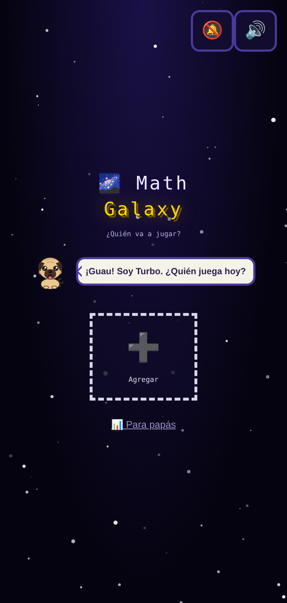
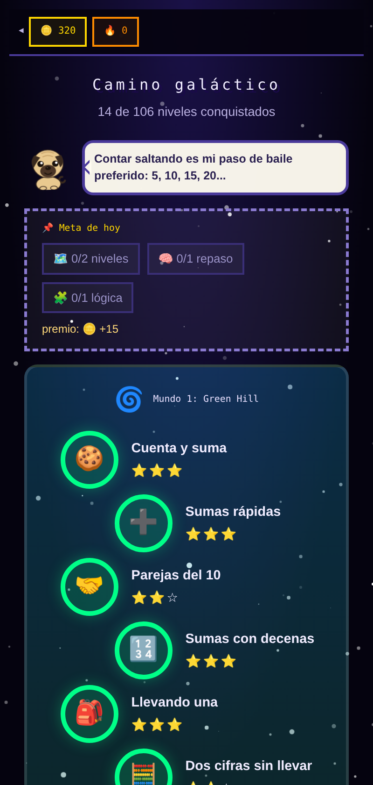
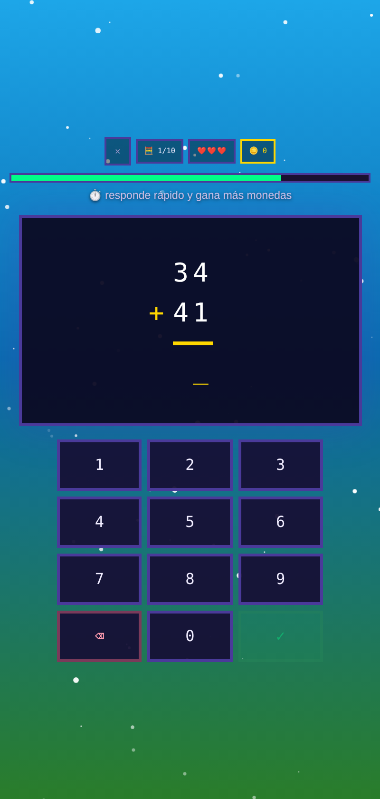
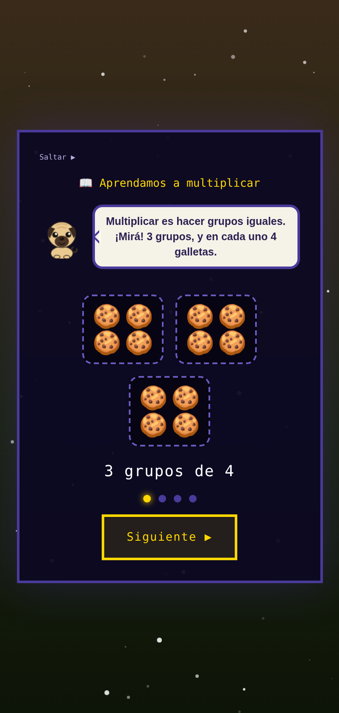
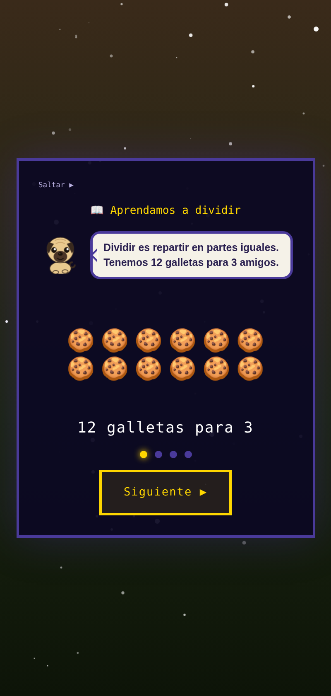

# 🐶 Turbo's Math Galaxy

Un juego educativo de matemáticas en español para niños, con **Turbo el pug** como mascota. El niño avanza por un camino de niveles y mundos, enfrenta jefes, gana monedas y desbloquea recompensas mientras practica desde la lógica básica hasta la multiplicación y la división.

> El juego no es solo "matemáticas gamificadas": cada mecánica está elegida a partir de **evidencia de la investigación en didáctica de las matemáticas y psicología cognitiva del aprendizaje**. Este README documenta esas decisiones y sus referencias, para que cualquiera pueda revisar el porqué de cada una.

---

## 📸 Capturas

<table>
  <tr>
    <td align="center" width="33%">
      <br>
      <sub><b>Perfiles</b><br>estilo Netflix, uno por niño</sub>
    </td>
    <td align="center" width="33%">
      <br>
      <sub><b>Inicio</b><br>camino, práctica, reto, colección…</sub>
    </td>
    <td align="center" width="33%">
      <br>
      <sub><b>Camino</b><br>mundos, niveles, estrellas y jefes</sub>
    </td>
  </tr>
  <tr>
    <td align="center" width="33%">
      <br>
      <sub><b>Columna vertical</b><br>multi-dígito, unidades bajo unidades</sub>
    </td>
    <td align="center" width="33%">
      <br>
      <sub><b>Tienda</b><br>poción, escudo, lupa y doble intento</sub>
    </td>
    <td align="center" width="33%">
      <br>
      <sub><b>Equípate</b><br>elige tus ítems antes del nivel</sub>
    </td>
  </tr>
  <tr>
    <td align="center" colspan="3">
      <b>📖 Micro-lecciones — Turbo enseña el concepto <i>antes</i> de practicar</b>
    </td>
  </tr>
  <tr>
    <td align="center" width="50%" colspan="2">
      <br>
      <sub><b>Multiplicación</b> · grupos iguales → arreglo → ejemplo</sub>
    </td>
    <td align="center" width="50%">
      <br>
      <sub><b>División</b> · repartir en partes iguales (e inversa de ×)</sub>
    </td>
  </tr>
</table>

---

## 🎮 Qué es

- **Pequeño explorador** (~4-5 años): 52 niveles, 13 mundos — lógica y matemáticas tempranas, con **10 minijuegos intercalados** en el propio camino y dificultad que se ajusta al niño.
- **Aventurero** (~8 años): 100+ niveles, 11 mundos — sumas, restas, multiplicación, división, fracciones, patrones y jefes.
- Mascota interactiva (Turbo el pug, **o el compañero que el niño elija**), camino de niveles y jefes de fin de mundo.

## ✨ Características

- **🐶 Turbo, la mascota:** un pug interactivo que reacciona (hace "guau"), da pistas y ánimos, y se puede **personalizar con outfits**.
- **🐾 Compañeros desbloqueables:** al avanzar, el niño desbloquea **nuevos personajes que reemplazan a Turbo si él quiere** — **🐱 Michi** (gatito, al llevar 12 niveles) y **🐕 Bruno** (perro negro despeinado, a los 30). El niño **elige** a quién ver como su acompañante; es una preferencia, nunca una obligación, y funciona igual en el modo de los más pequeños ("Mi compañero").
- **📖 Micro-lecciones:** antes de introducir un concepto nuevo (multiplicación, división), Turbo lo explica en pocos segundos con dibujos — saltable y re-visible desde "¿cómo funciona?". Enseña, no solo evalúa.
- **👨‍👩‍👧 Perfiles estilo Netflix:** hasta 4 perfiles por dispositivo, cada niño con su nombre, avatar, edad y **progreso independiente** (guardado en `localStorage`).
- **🗺️ Camino de niveles y jefes:** avance por mundos temáticos (playa, bosque, espacio, volcán, castillo…), con **jefes** de fin de mundo que dan más reto y recompensa.
- **🎉 Mensajes de racha:** al encadenar **3, 5 o 7 respuestas seguidas**, aparece un mensaje saltón que **celebra el esfuerzo** ("¡3 seguidas!", "¡Racha en fuego!"). Refuerzo positivo inmediato, al estilo de las apps de aprendizaje por rachas.
- **🎁 Cofre del tesoro:** al terminar un nivel puede aparecer un **cofre que el niño abre tocándolo varias veces**; adentro hay **monedas o ítems al azar** (más monedas que ítems, para no saturar). La recompensa es una **sorpresa que se gana jugando** — nunca se compra con dinero real.
- **📖 Álbum de stickers:** cada nivel superado regala un **sticker coleccionable** (animales, naves, planetas…) que se guardan en "Mi álbum".
- **🪙 Monedas y 🛒 tienda:** se ganan monedas por acertar (más si respondés rápido) y se gastan en ítems — **🧪 Poción de vida** (corazón extra), **🛡️ Escudo** (absorbe un error automáticamente), **🔍 Lupa mágica** (revela el truco de una pregunta) y **🔄 Doble intento** (si te equivocas, *tú eliges* volver a intentar esa pregunta sin perder corazón). En la tienda también está el **ropero de Turbo** para vestirlo con las monedas, incluidos **outfits de temporada** (🎃 Halloween, 🎅 Navidad, 💝 febrero, 🐰 abril) que solo aparecen en su mes.
- **⭐ Superestrella:** ítem raro que se **gana** jugando (drop al acertar o por racha larga) y da invulnerabilidad por varias preguntas.
- **🎯 Mapa de dominio de hechos:** rastrea qué hechos (sumas, tablas…) ya domina el niño, marcándolos con estrellas — recordatorio visual del progreso real.
- **⚡ Reto relámpago:** modo de 60 segundos que guarda el **récord** personal y refuerza la fluidez.
- **📅 Metas diarias:** objetivos por día para sostener el hábito de práctica.
- **📱 PWA instalable:** funciona offline y se instala en el teléfono como una app.

## 🧱 Tecnología

- HTML/CSS/JavaScript, empaquetado en un único `app.js` que carga `index.html`. **Sin build step para la web.**
- **PWA** instalable (manifest + service worker), progreso guardado en `localStorage`.
- Empaquetado para móvil (iOS/Android) con **Capacitor 7**.

### Correr en el navegador

```bash
python3 -m http.server 5000
# abrir http://localhost:5000
```

### Build móvil (cuando cambia `app.js`)

```bash
node scripts/build.js   # copia los assets web a www/
npx cap sync            # sincroniza con android/ e ios/
```

---

## 🧠 Decisiones de diseño y su base científica

El juego aplica técnicas con respaldo empírico: **recuerdo activo** (escribir la respuesta en vez de solo reconocerla), **repetición espaciada**, **práctica intercalada**, conteo saltado como puente a las tablas, la **recta numérica** (uno de los mejores predictores del logro matemático), **el tiempo como premio y nunca como castigo**, y mensajes de esfuerzo en lugar de elogios a la inteligencia.

A continuación, las mecánicas principales y la razón detrás de cada una.

| Mecánica | Qué hace | Fundamento | Ref. |
|---|---|---|---|
| **Recuerdo activo** | El niño escribe la respuesta, no la reconoce entre opciones. | La recuperación activa produce aprendizaje más duradero que el reconocimiento pasivo (*test-enhanced learning*). | [1] |
| **Repetición espaciada / intercalada** | Los hechos vuelven días después y las operaciones se mezclan. | El espaciado y la intercalación mejoran la retención y la flexibilidad estratégica frente al bloqueo por tipo. | [1][2] |
| **Warm-ups de 1 dígito en niveles altos** | ~20 % de las preguntas en mundos avanzados son sumas/restas de un dígito. | Los niveles altos se traban cuando los hechos básicos no están automatizados: la memoria de trabajo se gasta *recalculando lo básico* (carga cognitiva). Intercalar recuperación de hechos básicos lo alivia. | [2][3] |
| **Tiempo como premio, no castigo** | Responder rápido da monedas y segundos extra; el tiempo nunca resta corazones. | La presión de tiempo eleva la **ansiedad matemática**, que consume memoria de trabajo y empeora el rendimiento. | [4] |
| **Protectores de tiempo (congelar)** | Cada 2–3 correctas (razón variable) la siguiente pregunta viene con el tiempo congelado. | Menos presión de tiempo en momentos clave + los refuerzos de **razón variable** sostienen mejor la motivación que los fijos. | [4] |
| **Superestrella (invulnerabilidad)** | Ítem raro que evita perder corazón por varios errores, **pero sigue mostrando la respuesta correcta**. | Reduce el miedo a equivocarse y favorece el riesgo productivo; se conserva la **retroalimentación correctiva**, que es lo que enseña (no el castigo). | [1] |
| **Doble intento** | Ítem que el niño **decide** usar tras un error para reintentar esa misma pregunta (sin ver la respuesta) en vez de perder un corazón. | Un segundo intento de recuperación tras fallar, en vez de solo mostrar la solución, refuerza el aprendizaje (recuperación activa y agencia del alumno). | [1] |
| **Mensajes de racha (3/5/7)** | Celebración saltona al encadenar respuestas correctas, elogiando el **esfuerzo y la constancia**, no la inteligencia. | La retroalimentación positiva inmediata sobre la competencia sostiene la motivación intrínseca; elogiar el esfuerzo (no el "ser listo") fomenta una **mentalidad de crecimiento**. | [4][10][11] |
| **Cofre del tesoro (recompensa variable)** | Al terminar un nivel puede aparecer un cofre que el niño abre y suelta monedas/ítems al azar; **se gana jugando, nunca se paga con dinero**. | Los refuerzos de **razón/recompensa variable** sostienen la conducta mejor que los fijos. Se mantienen **cosméticos y ganables** a propósito: el pago con dinero real por recompensas aleatorias (*loot boxes*) preocupa por su parecido con el juego de azar y no tiene lugar en un producto infantil. | [4][12] |
| **Compañeros desbloqueables** | Personajes nuevos que el niño **elige** libremente para reemplazar a Turbo, desbloqueados por progreso. | Ofrecer **elección y personalización** apoya la **autonomía**, uno de los motores de la motivación intrínseca según la teoría de la autodeterminación; las recompensas se mantienen cosméticas para no erosionar el interés por aprender (*efecto de sobrejustificación*). | [10][11] |
| **Micro-lecciones (× y ÷)** | Antes de un concepto nuevo, Turbo lo explica en ~15–25 s con dibujos (grupos iguales → arreglo → suma repetida → ejemplo resuelto), saltable y re-visible con "¿cómo funciona?". | La práctica de recuperación consolida lo ya entendido, no lo enseña. Para novatos, la **instrucción guiada explícita** supera al descubrimiento solo, y estudiar un **ejemplo trabajado** antes de practicar baja la carga cognitiva. Secuencia **CRA** (concreto→pictórico→abstracto). | [9] |
| **Recta numérica** | Representación central para sumar/restar y comparar. | La estimación en la recta numérica es uno de los predictores más robustos del logro matemático. | [5] |
| **Layout horizontal para cálculo mental** | Hechos de 1 dígito y cálculo mental se muestran en horizontal (`45 + 23`). | El formato **horizontal** favorece estrategias de descomposición basadas en el valor posicional. | [6][7] |
| **Layout en columna para multi-dígito** | Sumas/restas con operandos de 2+ dígitos se muestran apiladas (unidades bajo unidades), como en la escuela. | El formato **vertical** descarga la memoria de trabajo en el multi-dígito con llevada/préstamo y facilita la transferencia al algoritmo escolar. Se introduce **después** del cálculo mental, no como única vía. | [6][7][8] |
| **Dificultad escalada por niño** (perfil pequeño) | El tamaño de los números dentro de cada nivel se ajusta solo, buscando que el niño acierte ~3 de cada 4. La edad solo siembra el punto de partida; el desempeño manda después. El papá puede fijarla desde el informe. | Se ordena por **nivel de pensamiento, no por edad**: es el hallazgo central de las **trayectorias de aprendizaje**, cuyo enfoque sostiene los ECAs de Building Blocks/TRIAD. Los **rangos numéricos** de cada banda se anclan a estándares (Common Core K-2; sentido numérico de LOMLOE). El **objetivo de ~75-85% de acierto** replica lo que usa Math Garden (ítems con p(éxito)=.75) y la "regla del 85%". La dificultad **nunca bloquea niveles ni quita estrellas**: baja la carga, no sube la presión. La banda "Normal" deja los niveles **exactamente como están escritos**, así que ajustar nunca es un requisito. | [13][14][15][16] |
| **Frustración ≠ dificultad** | Un fallo se lee en contexto: si la respuesta fue mucho más lenta que la mediana **del propio niño**, si lleva muchas preguntas seguidas, o si acaba de romper una racha, no se baja la dificultad — se anima y se ofrece un minijuego. | El mismo síntoma puede venir de distintas causas: cuando el problema es cansancio o frustración, rebajar el reto no ayuda porque no es que el niño no pueda, es que ya no está disponible para aprender. La presión y la ansiedad consumen memoria de trabajo, así que se responde **cambiando de actividad**, no subiendo la exigencia. Comparar al niño consigo mismo evita leer como frustrado a un niño simplemente pausado. | [3][4] |
| **Potenciador por acompañante** (camino del aventurero) | Elegir compañero deja de ser solo estético: el pug a veces evita perder un corazón (y casi siempre con uno solo), la gata congela el reloj más seguido y regala segundos, Bruno da una moneda extra por acierto y la zorra encuentra más cofres con más objetos. | Da **agencia** sobre la propia experiencia, que sostiene la motivación mucho mejor que una recompensa externa. El del pug se concentra donde un niño abandona — con un corazón — así que amortigua el momento de mayor frustración sin quitar el reto: salva **una sola vez por nivel**, así que acertar sigue importando. Los potenciadores solo existen en el camino del aventurero, porque el del pequeño no tiene vidas, reloj, monedas ni objetos; por eso su selector no los anuncia. | [3][4] |
| **Minijuegos dentro del camino** | 10 minijuegos (memoria, parejas, el diferente, sombras, vías del tren, cajas, cubos, **recta numérica**, ordenar, secuencias) aparecen intercalados como una pregunta más, con un botón para cambiar de juego sin penalización. | La **práctica intercalada** y el cambio de formato sostienen la atención y la flexibilidad estratégica frente al bloqueo por tipo. La recta numérica se incorpora aquí por ser uno de los predictores más robustos del logro matemático. El botón de cambio evita que un puzzle sin salida atrape al niño, y no cuenta como error: la agencia sostiene la motivación. | [2][5][10] |

### La representación provoca la estrategia

Un hallazgo clave que guía el juego: **el formato "avisa" qué estrategia usar**. Los problemas horizontales tienden a resolverse con descomposición mental (valor posicional, de izquierda a derecha); los verticales, con el algoritmo de columna (dígito a dígito, de derecha a izquierda). Por eso el juego usa **horizontal para construir sentido numérico** y reserva **la columna para el multi-dígito**, alineando cada representación con la estrategia que se busca desarrollar — e introduciendo el algoritmo estándar sin prisa, para no "desenseñar" el valor posicional [6][7][8].

---

## 📚 Referencias

Enlaces verificados y obras fundamentales que respaldan las decisiones anteriores.

1. **Roediger, H. L., & Karpicke, J. D. (2006).** *Test-Enhanced Learning: Taking Memory Tests Improves Long-Term Retention.* Psychological Science — recuerdo activo y aprendizaje por recuperación.
2. **Interleaved Learning in Elementary School Mathematics: Effects on the Flexible and Adaptive Use of Subtraction Strategies.** Frontiers in Psychology / PMC. https://www.ncbi.nlm.nih.gov/pmc/articles/PMC6385790/
3. **Teoría de la carga cognitiva (Sweller y cols.).** La memoria de trabajo limitada se satura si los hechos básicos no están automatizados. Base del diseño de warm-ups de hechos.
4. **Ashcraft, M. H., & Kirk, E. P. (2001).** *The relationships among working memory, math anxiety, and performance.* Journal of Experimental Psychology: General — la ansiedad matemática y la presión de tiempo consumen memoria de trabajo.
5. **Educación Matemática Realista (RME)** y la **recta numérica vacía** (Freudenthal Institute; Beishuizen) — cálculo mental antes del algoritmo; la recta numérica como andamio y predictor del logro.
6. **Students' Multidigit Addition & Subtraction Strategies** — el formato horizontal induce descomposición y el vertical el algoritmo estándar. https://www.projectmath.net/wp-content/uploads/2017/06/Students%E2%80%99-Multidigit-Addition-_-Subtraction.pdf
7. **Mental computation or standard algorithm? Children's strategy choices on multi-digit subtractions** (European Journal of Psychology of Education, 2015). https://link.springer.com/article/10.1007/s10212-015-0255-8 · y **Children's Strategy Choices on Complex Subtraction Problems** (Frontiers, 2018): https://pmc.ncbi.nlm.nih.gov/articles/PMC6057409/
8. **Kamii, C., & Dominick, A. (1998).** *The Harmful Effects of Algorithms in Grades 1–4* (NCTM Yearbook) — el algoritmo estándar impuesto demasiado pronto puede "desenseñar" el valor posicional. Resumen: https://edlab.tc.columbia.edu/blog/5720-The-Harmful-Effects-of-Algorithms-in-Grades-1-4 · Crítica metodológica (para balance): https://nonpartisaneducation.org/Review/Reviews/v9n2.html
9. **Kirschner, P. A., Sweller, J., & Clark, R. E. (2006).** *Why Minimal Guidance During Instruction Does Not Work: An Analysis of the Failure of Constructivist, Discovery, Problem-Based, Experiential, and Inquiry-Based Teaching.* **Educational Psychologist, 41**(2), 75–86 — para el novato, la guía mínima (descubrimiento puro) es menos eficaz que la instrucción guiada explícita. Relacionados: el **efecto del ejemplo trabajado** (Sweller, carga cognitiva) y la secuencia **CRA / concreto-pictórico-abstracto** (Bruner; método Singapur).
10. **Deci, E. L., & Ryan, R. M. (1985, 2000).** *Self-Determination Theory* — la **autonomía**, la **competencia** y la **relación** sostienen la motivación intrínseca; ofrecer elección y retroalimentación de competencia (no control ni presión) favorece el compromiso. Ryan & Deci (2000), *Intrinsic and Extrinsic Motivations*, Contemporary Educational Psychology, 25(1), 54–67.
11. **Dweck, C. S. (2006).** *Mindset: The New Psychology of Success* — elogiar el **esfuerzo y la estrategia** (no la inteligencia) fomenta una mentalidad de crecimiento. Advertencia complementaria: **Lepper, Greene & Nisbett (1973)**, *efecto de sobrejustificación* — recompensas extrínsecas mal usadas pueden minar el interés intrínseco; por eso aquí las recompensas son cosméticas, sorpresivas y ganadas jugando.
12. **Skinner, B. F. (1953)** — los programas de refuerzo de **razón variable** producen conductas más persistentes que los de razón fija (base del cofre sorpresa). Nota ética: la literatura sobre **loot boxes** (p. ej. Zendle & Cairns, 2018; Drummond & Sauer, 2018) documenta su parecido estructural con el juego de azar cuando median pagos con dinero real — riesgo que este juego evita al no vender recompensas aleatorias.

13. **Clements, D. H., & Sarama, J.** *Learning and Teaching Early Math: The Learning Trajectories Approach* (Routledge) — trayectorias de aprendizaje: cada dominio tiene una progresión de niveles que los niños recorren en orden, con edades **aproximadas** como referencia y no como regla. Es el marco que justifica ordenar por nivel de pensamiento en vez de por edad.
14. **Building Blocks / TRIAD** — el enfoque de trayectorias evaluado con ensayos controlados aleatorizados: efectos de ~0.72 DE a gran escala y de 1-2 DE en estudios menores. Reporte del *What Works Clearinghouse* (IES, Dept. de Educación de EE. UU.): https://ies.ed.gov/ncee/WWC/Docs/InterventionReports/WWC_Building-Blocks_report.pdf
15. **Estándares curriculares para los rangos numéricos.** *Common Core State Standards for Mathematics*, K-2 (https://www.thecorestandards.org/Math/) — contar hasta 100, fluidez dentro de 5 en K, dentro de 20 en 1.º, de memoria dentro de 20 y hasta 100/1000 en 2.º. **LOMLOE** (España), currículo de Matemáticas por "sentido numérico", con subitización y conteo en Infantil y recuento hasta 999 en primer ciclo: https://educagob.educacionfpydeportes.gob.es/curriculo/curriculo-lomloe/menu-curriculos-basicos/ed-primaria/areas/matematicas.html
16. **Tasa de acierto objetivo.** **Klinkenberg, S., Straatemeier, M., & van der Maas, H. (2011)**, *Computer adaptive practice of maths ability using a new item response model for on the fly ability and difficulty estimation* (Computers & Education) — el sistema Math Garden/Rekentuin estima habilidad y dificultad tipo **Elo** con cada respuesta y selecciona ítems con probabilidad de éxito de **.75**. **Wilson, R. C., Shenhav, A., Straccia, M., & Cohen, J. D. (2019)**, *The Eighty Five Percent Rule for optimal learning*, **Nature Communications 10**, 4646 — existe un punto óptimo de dificultad, con tasa de error cercana al 15.87%.

> **Nota honesta sobre las citas:** los enlaces se verificaron al momento de escribir este documento. Para uso académico formal conviene confirmar autores, año, DOI y páginas en la fuente original. Las obras marcadas sin enlace (1, 3, 4, 5, 9, 10, 11, 12, 13, 16) son referencias fundamentales del área, ampliamente citadas y fáciles de localizar.
>
> **Sobre las bandas de dificultad (ref. 13):** las edades nivel-por-nivel de las trayectorias de Clements & Sarama **no se verificaron una a una** en la fuente primaria al escribir esta versión. Lo que sí está verificado es la estructura del marco, la evidencia de TRIAD (ref. 14) y los rangos numéricos de Common Core y LOMLOE (ref. 15), que son los que fijan el techo de cada banda. Como el sistema **se ajusta por desempeño y la edad solo siembra el punto de partida**, un desajuste en la conjetura inicial se corrige solo en ~12 respuestas; aun así, conviene contrastar la tabla de bandas con el libro antes de tratarla como definitiva.

---

## 🗺️ Estado del proyecto

En desarrollo activo. Objetivo: convertir el juego en una app móvil educativa (iOS/Android). Las mecánicas y la dificultad se ajustan de forma iterativa con base en la evidencia y en pruebas con niños reales.

Sugerencias y reportes son bienvenidos vía *issues*.
